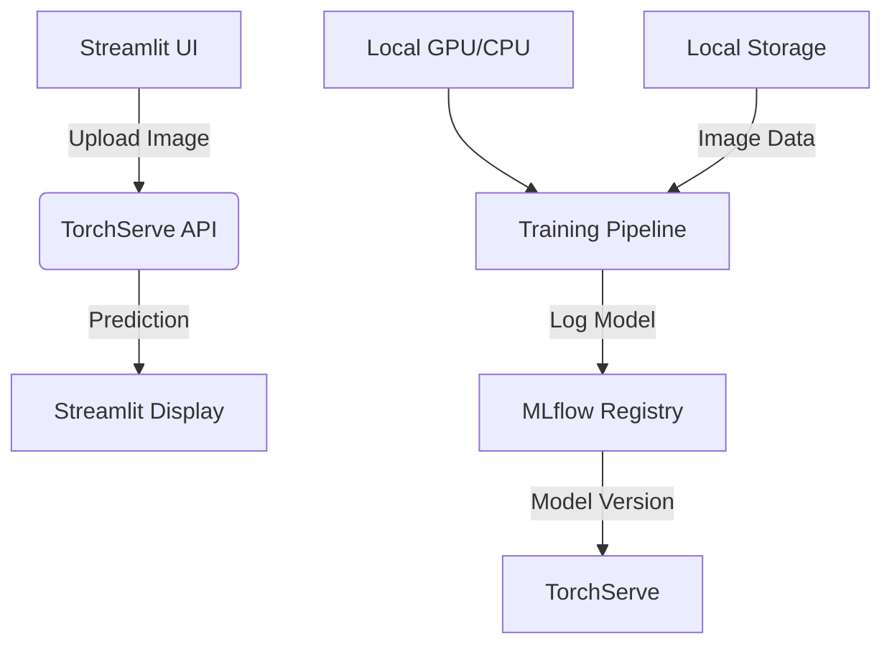

# Skin Lesion Classification System


## A Comprehensive MLOps Solution for Medical Image Analysis

This project implements an end-to-end skin lesion classification system using state-of-the-art deep learning techniques. The solution integrates TorchServe for model serving, MLflow for experiment tracking and model management, and Streamlit for an intuitive web interface. Designed specifically for dermatological applications, this system can identify 9 different types of skin lesions with clinical-grade accuracy.

## Key Features

- **Medical-Grade Classification**: Identifies 9 types of skin lesions with detailed probability distributions
- **End-to-End MLOps Pipeline**: From model training to deployment and monitoring
- **Interactive Visualization**: Intuitive probability displays for clinical decision support
- **Model Version Control**: Track and manage different model versions with MLflow
- **Production Monitoring**: Real-time performance metrics and prediction tracking
- **Privacy-First Design**: Runs entirely on your local infrastructure

## System Architecture



## Technology Stack

- **Deep Learning**: PyTorch, Vision Transformers (ViT)
- **Model Serving**: TorchServe
- **MLOps**: MLflow (Tracking, Registry)
- **Web Interface**: Streamlit
- **Image Processing**: OpenCV, Pillow
- **Visualization**: Matplotlib, Plotly

## Installation

### Prerequisites

- Python 3.8+
- PyTorch 2.0+
- Java 11+ (for TorchServe)

### Setup

1. **Clone the repository**:
   ```bash
   git clone https://github.com/yourusername/skin-lesion-classification.git
   cd skin-lesion-classification
   ```

2. **Create and activate virtual environment**:
   ```bash
   python -m venv lesenv
   source lesenv/bin/activate
   ```

3. **Install dependencies**:
   ```bash
   pip install -r requirements.txt
   ```

4. **Download pretrained model**:
   ```bash
   wget https://example.com/models/best_model.pth -P model_store/
   ```

## Usage

### 1. Start MLflow Tracking Server
```bash
cd mlflow_tracking
chmod +x mlflow_server.sh
./mlflow_server.sh
```

### 2. Register Model in MLflow
```bash
python register_model.py
```

### 3. Start TorchServe
```bash
cd torchserve
chmod +x start_torchserve.sh
./start_torchserve.sh
```

### 4. Launch Streamlit Application
```bash
cd streamlit_app
streamlit run app.py
```

### 5. Access the Applications
- **Streamlit UI**: http://localhost:8501
- **MLflow UI**: http://localhost:5001
- **TorchServe API**: http://localhost:8080/predictions/skin_vit

## Project Structure

```
skin-lesion-classification/
├── mlflow_tracking/              # MLflow server configuration
│   └── mlflow_server.sh
├── torchserve/                   # TorchServe configuration
│   ├── config.properties
│   └── start_torchserve.sh
├── streamlit_app/                # Streamlit application
│   ├── app.py                    # Main application
│   └── utils.py                  # Helper functions
├── model_store/                  # Pretrained models
│   └── best_model.pth
├── training/                     # Training scripts
│   ├── train.py                  # Training pipeline
│   └── dataset.py                # Data loading utilities
├── handlers/                     # TorchServe handlers
│   └── skin_lesion_handler.py
├── requirements.txt              # Python dependencies
└── README.md                     # Project documentation
```

## Dataset

The system uses the [ISIC 2019 Challenge Dataset](https://challenge.isic-archive.com/data/) which contains:

- 25,331 training images
- 8,232 test images
- 9 diagnostic categories:
  - Melanoma
  - Melanocytic nevus
  - Basal cell carcinoma
  - Actinic keratosis
  - Benign keratosis
  - Dermatofibroma
  - Vascular lesion
  - Squamous cell carcinoma
  - None of the above

## Customization

To train your own model:

1. Place dataset in `data/` directory:
   ```
   data/
   ├── Train/
   │   ├── Melanoma/
   │   ├── Nevus/
   │   └── ...
   └── Test/
       ├── Melanoma/
       ├── Nevus/
       └── ...
   ```

2. Run training pipeline:
   ```bash
   cd training
   python train.py
   ```

3. Monitor training in MLflow: http://localhost:5001
